OpenPilot

Street Lights and Signs Recognition

By cmma(Elliot)

1. **Introduction**

Although there has been teaser for traffic lights by comma however it didn’t go anywhere due to reason openpilot wasn’t ready. Openpilot is able to handle lateral control(steer) and longitudinal control(ACC-Active Cruise Control) pretty well however there wasn’t full stop and go solution until comma pedal(interceptor) was released earlier of 2018 for Honda’s only and  by end of the year we had for Toyota and Tesla which wouldn’t be possible with effort from community. 

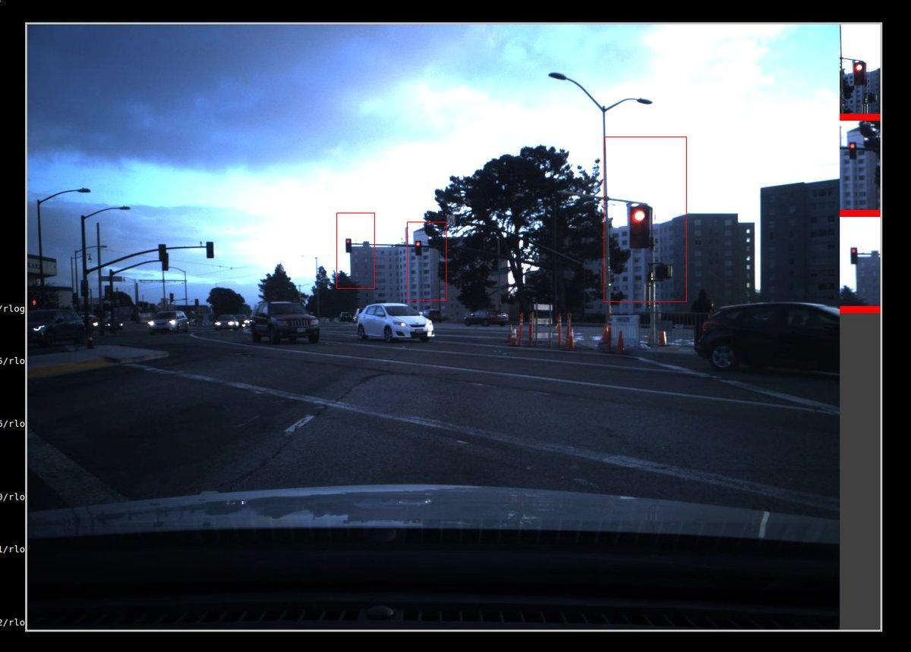

                          Model teaser for traffic lights recognition on **[twitte**r](https://twitter.com/comma_ai/status/956039235169083392)

Besides pedal there were other things that were required to solve the puzzle where last year 2018 was BIG year where comma released multiple tools where community can do a lot more with OP. In 2018 a lot of new cars were ported which makes this project even more reason for devel. Following is list some of tools with description involved for this project that  comma released which will make this project possible with description involved on the project

* Forward Collision Warnings([Medium)](https://medium.com/@comma_ai/bringing-forward-collision-warnings-to-our-open-source-self-driving-car-7545b6e398cd?source=---------13------------------)-Although it won’t be used for traffic lights and signs project however it is good reference where OP can do breaking using longitudinal control. You can see [this](https://www.youtube.com/watch?v=WF3sgSctpwA) video where FCW is used on real time situation.

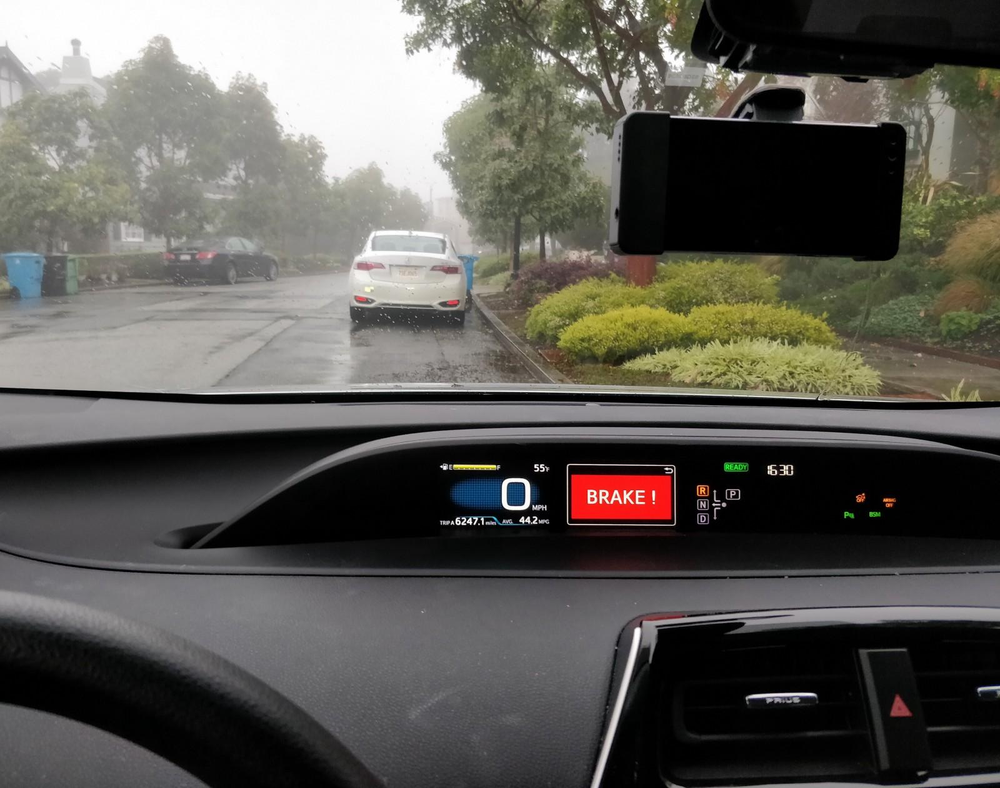

    Forward Collision Warning indicator on the dashboard

* Safety and Driver Attention([Medium](https://medium.com/@comma_ai/safety-and-driver-attention-2a33d3d23109))- On Medium, It doesn’t talk much details on dilemma but you can find them on [Github](https://github.com/commaai/openpilot/blob/860a48765d1016ba226fb2c64aea35a45fe40e4a/selfdrive/controls/lib/alerts.py#L60) where OP had it since OP(OpenPilot) release of v0.2.2 similar to AP(AutoPilot). I won’t be going in much details regarding dilemma but it is good source which will be used for traffic recognition. Driver monitor uses machine learning [model](https://github.com/commaai/openpilot/blob/devel/models/monitoring_model.dlc) which works in assets of [dilemma](https://github.com/commaai/openpilot/blob/devel/selfdrive/controls/lib/driver_monitor.py). 

* **Summary of dilemma and to be used on traffic recognition **: If user is distracted, OP will disengage and come to full stop which is similar situation to traffic lights and signs, Where we need to come to full stop and then resume that’s the only difference but similar logic will be applied from dilemma.

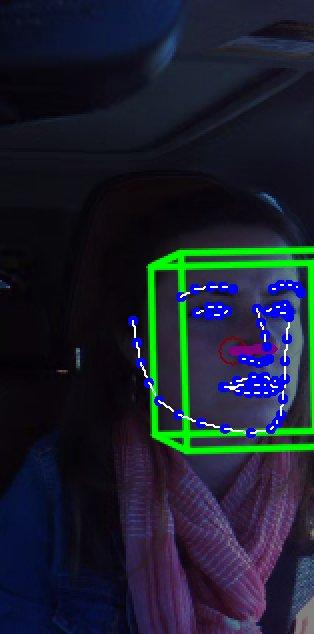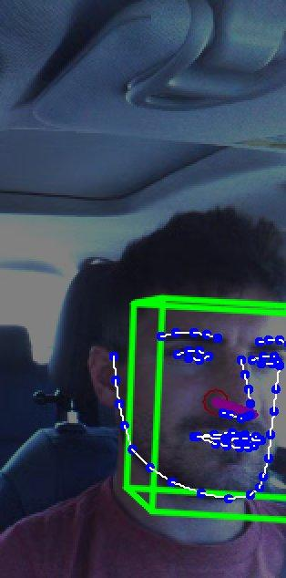

                                                                                                 Driver monitor in action.

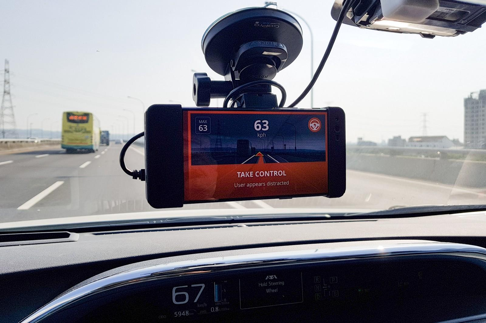

                                                   openpilot user getting a distracted alert (real user photo, not actor)

* Beginning to maps- In OP release v0.5.7, OP finally had the first release of using maps. Although not [HD maps](https://medium.com/@comma_ai/dataset-for-hd-maps-comma2k19-b10e8cd25a9) yet but instead [OSM](https://www.openstreetmap.org)(OpenStreetMap) where OP can finally slow down at curves using maps data along with it stay within speed limit which is all done using API calls.This will be second stage logic for traffic recognition  where real maps data will be used to get more accurate location for stopping. OSM does have mapping points where [traffic lights](https://wiki.openstreetmap.org/wiki/Tag:highway%3Dtraffic_signals) and [signs](https://wiki.openstreetmap.org/wiki/Key:traffic_sign) can be detected.

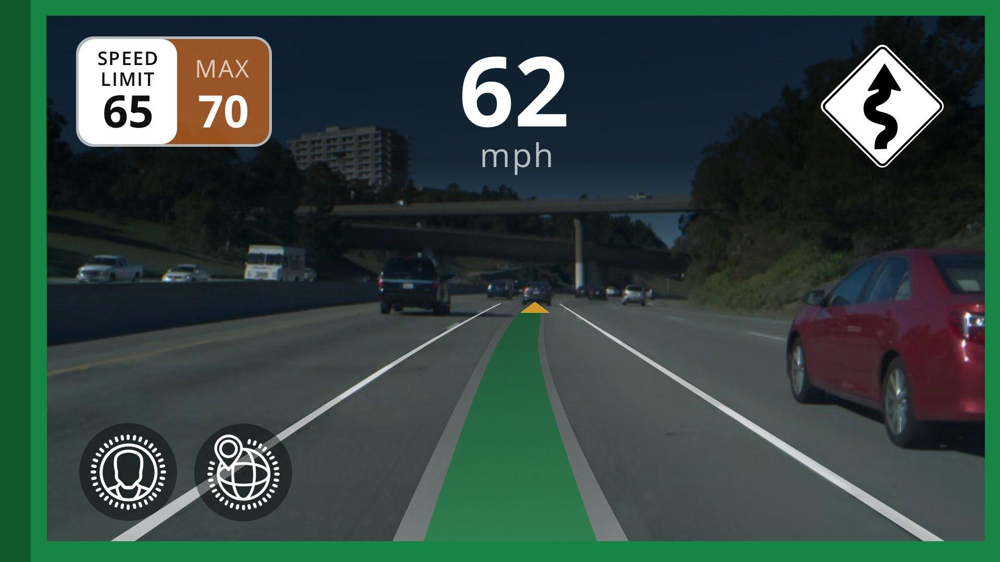

                                               Example of slow down at curves and staying within speed limit using OSM

* Last piece of puzzle was visiond which is finally [open source](https://github.com/commaai/openpilot/tree/devel/selfdrive/visiond) in recent release 0.5.8 where we can finally had new hardware for OP when needed for the project.

2. **TLAS(traffic lights and signs) problem explanation**

The problem is not detecting TLAS but instead the issue is where to stop and when to resume. As mentioned above examples where OP is already can come to full stop and resume using longitudinal control. When it comes to just full stop by it self it can do that by  FCW, Driver monitor and last of all it can slow down using maps data by OSM. 

Since it’s complicated problem i wanted to come up with localization based solution where no maps are used for stage 1 but instead logic is used. Due to reason EON currently has 1 camera detect vehicles and object in front,TLAS won’t be L3 solution at all it will be more of L2 where human still has to react to situations although which will change in future where new hardware can be added since visiond is open source.Following i will describe the IF’s situation with explanation. There are more situations with stop signs then traffic lights.

* I will start the stop signs if you look at the camera view of EON it’s not able to detect full view left and right view so  there are  blind spots at intersection that EON can’t see.

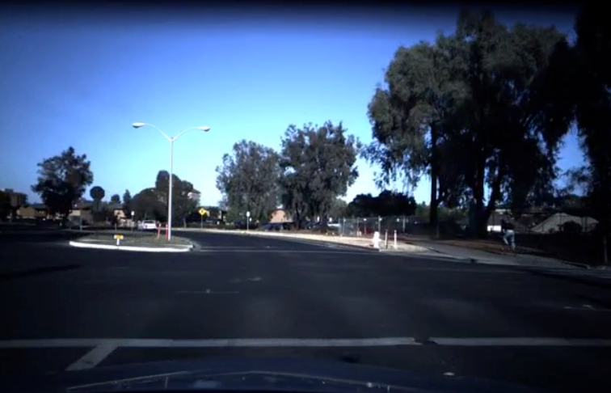

                          Blind spots at intersection found on  [cabana demo](https://community.comma.ai/cabana/?demo=1)

* Another problem is prediction- If your and another vehicle comes at the intersection at same time there is no safe way to predict when to resume along with it what if there is pedestrian crossing from opposite directions and then wants to come to your direction which are in general traffic situations that we as human can understand but as far as ML(machine learning) goes it will take a while until it’s close to perfect and to get there we need more hardware for OP in order to even get to that level.

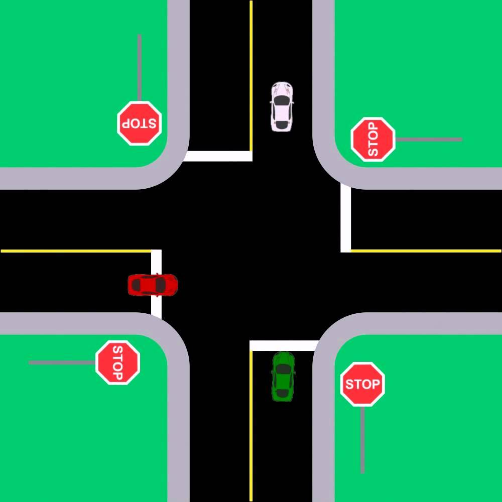

* Biggest problems are road conditions- Such as lights not working, missing lanes this is where maps comes handy in general. 

3. **TLAS L2 Solution**

Traffic lights and signs has completely different situations so for that reasons there are two solutions for each situations.

* I will start with stop signs again since i already have explained the situations with stops signs. Solution for stop signs is simple,ML will detect Stop signs which are located on right side if present if not OSM or Maps in general will come handy in future but in stage 1 it will detect for stop signs besides that  it will look for the crosswalk border line if present if not stop it will stop within 4 feet however using data speed needs to be within OSM speed limit where safely can be stopped within 150 feet.

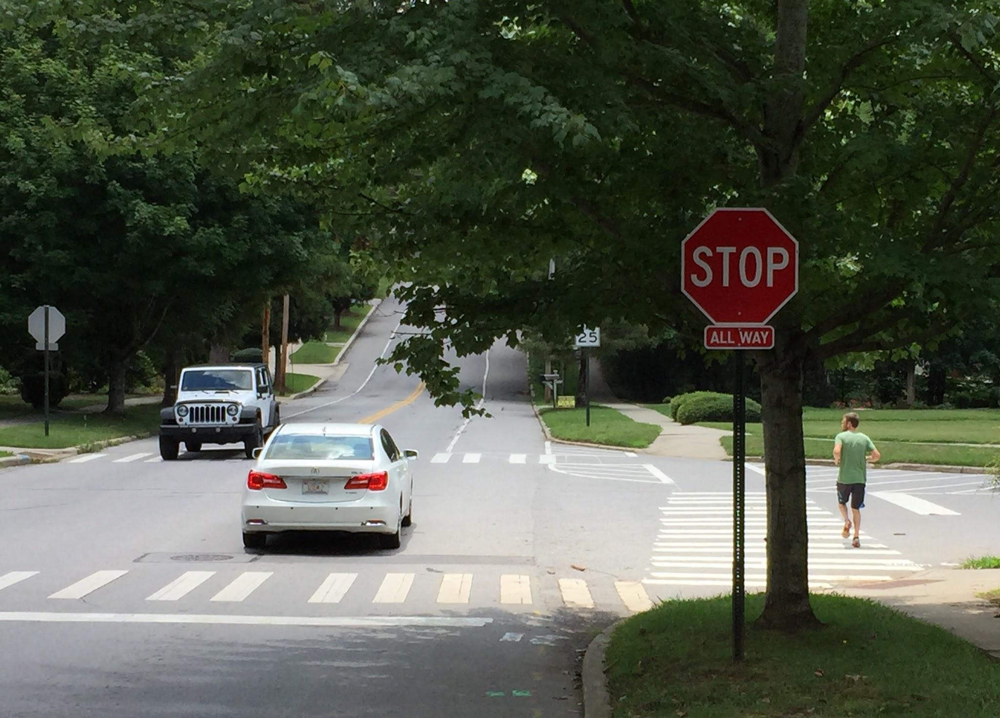

"Stop signs should be placed so that the sign roadside edge is at least 6-12 feet from the edge of pavement, with a 2 foot minimum for curbed roadways. Placement of the stop sign is to be on the right side of the roadway at either the stop line or (4) feet in advance of a crosswalk. If there is neither a stop line nor a crosswalk the sign should be placed where traffic can stop and clearly see both directions before entering the intersection, and no greater than 50 feet from the intersection."

* Due to safety reasons as mentioned above on the situations, It will only come to full stop and not able to resume by itself so for that situation you all you to do is cruise resume so you could continue on same intersection when safe where you do not have to press on brake or gas pedal.

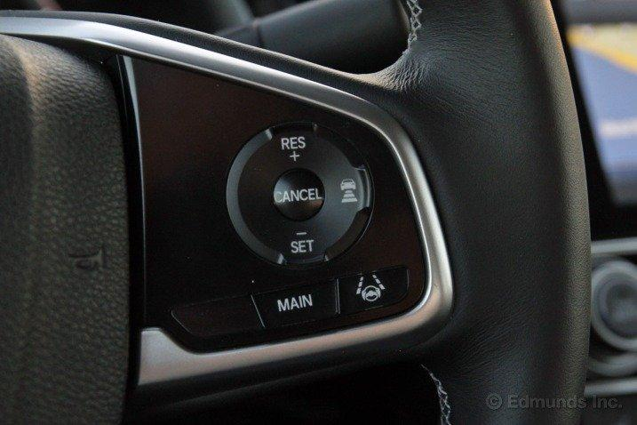

* Traffic lights will follow similar logic as stop sign where it will come to full stop after detecting the traffic light being red or yellow and it will stop before the crosswalk if present in perfect world if not OSM will be used as backup. Major difference with traffic lights will be auto resume since we can somewhat predict the situation not fully since it’s L2 solution.

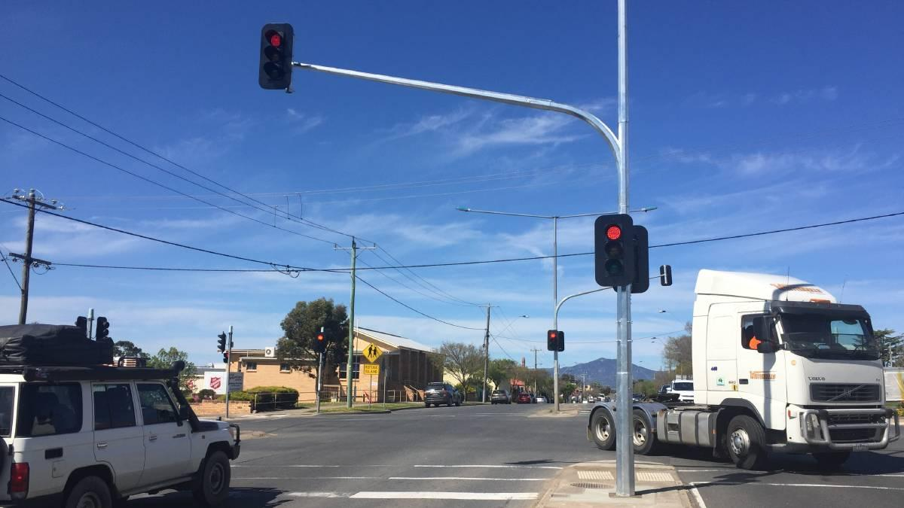

* Traffic lights with arrows going left or right will be completely ignored since OP can’t make full turns it will be meant for straight lanes only.

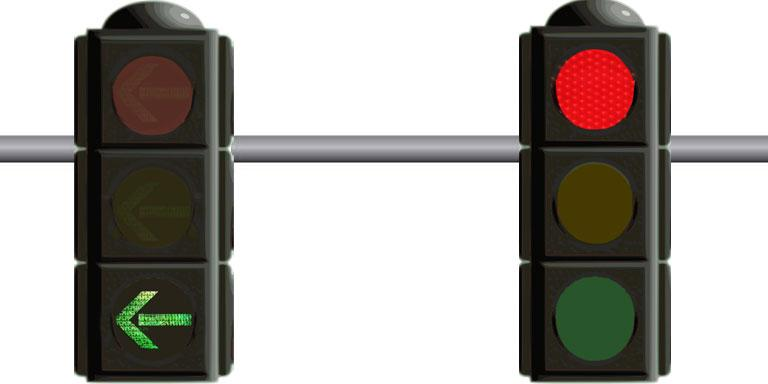

* In perfect world when there is green light there shouldn’t be any pedestrian on your way which is reason why auto resume for traffic lights is more predictables but you will be still required to pay attention since it will be L2 based detection. If emergency situation does occur that’s where FCW will come handy but don’t rely on it too much just in case of if situations. I’m not saying auto resume will be safe this is where dilemma comes in as well where making sure you are paying attention for any situation in general.  

* For safety reasons we might as well add another factor where before resume you will be required to touch the steering wheel just to confirm which can be probably used for stop signs as well. Will need more feedback.

* Complex problem about lights is that the lights are usually located after the intersection unlink stop signs before the intersection for that situation. For localization purpose we need to figure out typical intersection size with crosswalks before the border white line. It will be safer if stopped before the white line even if it’s like 5 feet off rather than crossing the intersection with danger. So in general solution main focus for stopping is white line before intersection this is where ML will help. Best practice for stopping will be using OSM so at least speed can be decreased before the intersection.

Here is [paper ](https://safety.fhwa.dot.gov/intersection/other_topics/fhwasa09027/resources/MassHighway%20Design%20Guide%20CH_6.pdf)for intersection which goes on details size.

4. **Model(ML)**

Model will be look at for just stop signs as far as lights goes it will only detect red, yellow and green if any arrows or any other signs will be ignored for now. 

* Model will be heavily trained based on intersection’s white line when detected prepare to slow down or completely stop if any TLAS are present.

* Traffic model will be running along with driver model where it will need visiond access. So it will be parallel model to driver model which will have completely different purpose. As or right now extra hardware is needed.

* @willem was nice enough to share a simple neural network to recognize the color of traffic lights on official comma’s repo located at 

                        [https://github.com/commaai/trafficlights](https://github.com/commaai/trafficlights)

5. **Background**

** **

 	I wrote full post regarding the project at [opc](https://opc.ai/guides/can-op-detect-traffic-lights-or-signs-mxnsye) where i did mention most of the details from here but it was project that was needed for me to work on next with help of community of course like anything else i have been involved in. 

* Please note this project won’t be upstreamed due to safety reasons however it will be a gimmick that we all can enjoy soon with help of community members.

6. **Conclusion**

**	**I know it won’t be a easy task for traffic lights but stop signs are different situation. Like they say anything is possible when you put your mind and soul into it. Please do forgive me if i have made any grammar errors, English is not my first language. Following are community members who are going to be part of the project so far:)

1. Mad genius who brought us auto lane change who i call albert einstein @BogGyver

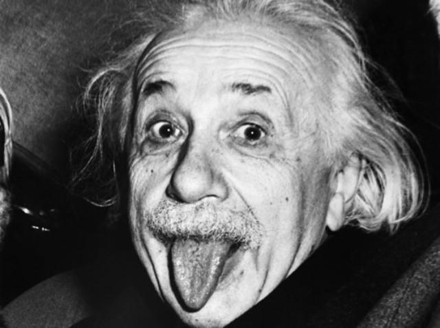

2. The king of gimmicks from Germany @arneschwarck 

3. Last one is special i call him the real life Iron man his name is @Alex Wang

He first brought the OP with flexray driver then visiond on pc and now he will helping with this project running model along with driver model:) 

4. And me of course the guy with bat wings who got the  plan and vision to begin something awesome.

